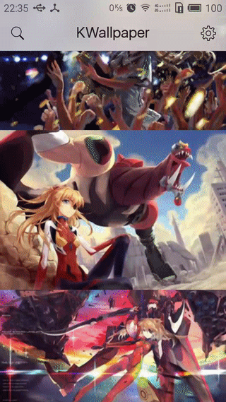
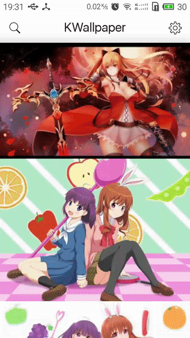

AnimeWallpaper
=====================

Download high quality pictures from Konachan.net.







AppStore
--------
[Wandoujia](http://www.wandoujia.com/apps/com.github.miao1007.animewallpaper)


Build Environment
-------------
Android Studio 2.0 or higher


Feature
-------

####1. FullHD Wallpaper

1. download, preview and share full HD anime wallpaper for free.
2. search by name (eg. yosuga_no_sora)

####2. iOS design implementation for Android

1. Toolbar with translucent statusbar for Kitkat device above
2. Realtime blur on Android(Dialog/ActionSheet/ListView)
3. Search/Indicator(Progressbar)/Translation animation

####3. A practice with latest library

1. OkHttp/Picasso/Retrofit
2. RxJava


####4. Recommend iOS UIView for Android

see [iOS UIView for Android](github_best_ios.md)


Getting started
--------

1. clone the project

  ```
  git clone https://github.com/miao1007/AnimeWallpaper.git --depth=1
  ```

2. remove or change your own key in [GlobalContext.java](https://github.com/miao1007/AnimeWallpaper/blob/master/app/src/main/java/com/github/miao1007/animewallpaper/support/GlobalContext.java)

  ```
  public class GlobalContext extends Application {

    static public void startThirdFrameWork() {
      /*
      * TODO: replace the key
      * see {@link <a href="http://bughd.com/doc/android">BUGHD</a>}
      * */
      FIR.init(instance,BuildConfig.BUG_HD_SDK_GENERAL_KEY);
      FIR.addCustomizeValue("DEBUG", BuildConfig.DEBUG + "");
    }

    .....
  }
  ```

3. build the project

License
---------
1. Icon: [Creative Commons Attribution-NoDerivs 3.0 Unported](https://icons8.com/license/)
2. Font: [SIL OPEN FONT LICENSE Version 1.1 - 26 February 2007](https://www.google.com/fonts)

Developed By
-------------
Leon - miao1007@gmail.com


