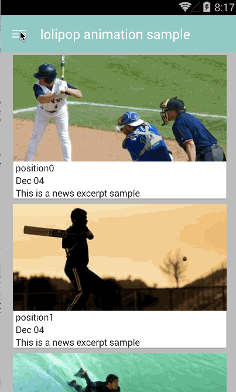

Lollipop-Animation-Sample
=====================

This is a L-animation sample for pre-5.0 device


Feature
-------------
######NavigationDrawer Animation


######RecyclerView Anmation


Build Environment
-------------
Android Studio 0.9.2

Technology Used
-------------
```
    compile 'com.android.support:appcompat-v7:21.0.0'
    //recyclerview
    compile 'com.android.support:cardview-v7:21.0.0'
    compile 'com.android.support:recyclerview-v7:21.0.0'
    //Picasso
    compile 'com.squareup.picasso:picasso:2.4.0'
    compile 'com.squareup.okhttp:okhttp-urlconnection:2.0.0'
    compile 'com.squareup.okhttp:okhttp:2.0.0'
``` 

Refferences
-------------
1. [NavigationDrawer Guide](http://blog.mosil.biz/2014/10/navigation-drawer-on-toolbar/)
2. [Recyclerview Layout Animation](https://github.com/mikepenz/Android-LollipopShowcase)
3. [Lollipop Themes and Style](http://antonioleiva.com/material-design-everywhere/)

TODO
-------------
1. I will add more animation and V7-widget in the future.
2. `makeSceneTransitionAnimation` between Activities is not support in pre-Lollipop device. I will try in another way

Developed By
-------------
Leon - miao1007@gmail.com